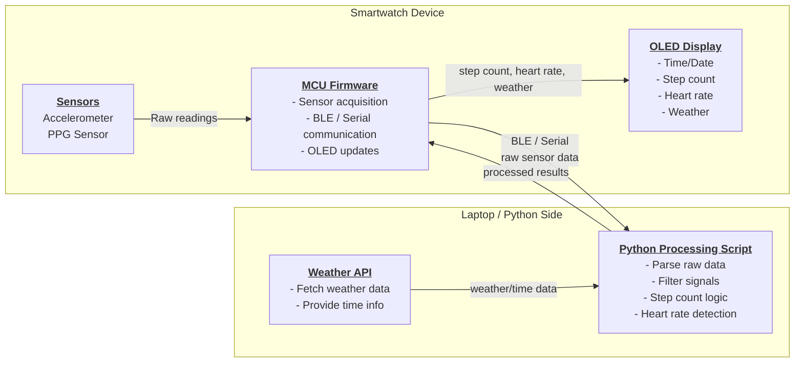

# Smartwatch Project

A smartwatch prototype developed as part of my electrical engineering projects.  
This project demonstrates hardware and software integration, including Arduino firmware, data processing with Python, and basic machine learning.

---

## Project Overview

This smartwatch prototype includes the following features:

- **Pedometer and idle detection** using a 3-axis accelerometer  
- **Heart rate monitoring** via hardware sensor  
- **Time, date, and weather display** using Wi-Fi API requests  
- **Data processing and analysis** using Python tools, including a Gaussian Mixture Model (GMM)  

---

## System Architecture



---


## Getting Started

### Arduino Firmware
1. Open the `.ino` files in the Arduino IDE.  
2. Select the correct board and port.  
3. Upload the code to the smartwatch hardware.  

### Python Tools
1. Create a virtual environment:
   ```bash
   python -m venv venv
   source venv/bin/activate 
   ```
2. Install dependencies:
   ```bash
   pip install -r requirements.txt
   ```
2. Run data processing script:
   ```bash
   python python-tools/process_data.py
   ```

---

## Notes

* Raw training data is not included to reduce repo size.
* The repository includes the pretrained GMM model (gmm_model.pkl) instead.